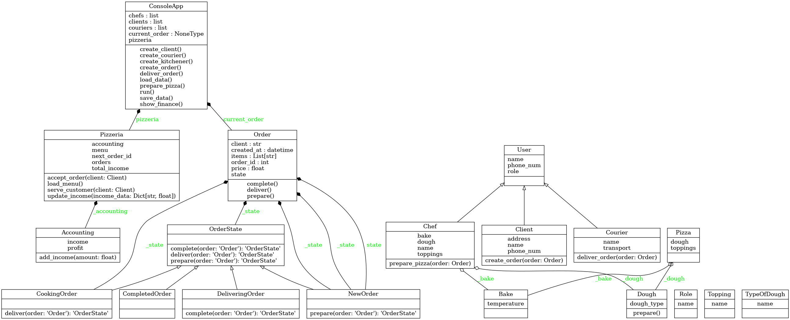

# Pizzeria Management System

## Описание
Система управления пиццерией, позволяющая клиентам делать заказы, поварам готовить пиццу, а курьерам доставлять заказы. Система ведет учет клиентов, заказов и финансов.

## Классы

### Dough
Класс, представляющий тесто для пиццы.
- **Атрибуты**:
  - `_dough_type`: Тип теста (толстое или тонкое).
- **Методы**:
  - `prepare()`: Подготовка теста.
  - `__str__()`: Возвращает строковое представление типа теста.

### Topping
Класс, представляющий начинку для пиццы.
- **Атрибуты**:
  - `name`: Название начинки.
- **Методы**:
  - `__str__()`: Возвращает название начинки.

### Bake
Класс, представляющий процесс выпечки пиццы.
- **Атрибуты**:
  - `_temperature`: Температура выпечки.
- **Методы**:
  - `__str__()`: Возвращает строку с температурой выпечки.

### Pizza
Класс, представляющий пиццу.
- **Атрибуты**:
  - `_toppings`: Список начинок.
  - `_dough`: Тип теста.
  - `_bake`: Процесс выпечки.
- **Методы**:
  - `__str__()`: Возвращает строку с количеством начинок.

### Order
Класс, представляющий заказ.
- **Атрибуты**:
  - `order_id`: Идентификатор заказа.
  - `client`: Клиент, сделавший заказ.
  - `items`: Список заказанных позиций.
  - `status`: Статус заказа (новый, в процессе приготовления, на доставке, завершен).
  - `created_at`: Дата и время создания заказа.
  - `price`: Общая стоимость заказа.

### Accounting
Класс для ведения финансового учета.
- **Атрибуты**:
  - `_income`: Общий доход.
  - `_expenses`: Общие расходы.
- **Методы**:
  - `add_income(amount)`: Добавляет доход.
  - `add_expense(amount)`: Добавляет расход.
  - `profit`: Возвращает текущую прибыль.

### User
Базовый класс для пользователей системы.
- **Атрибуты**:
  - `_name`: Имя пользователя.
  - `_gender`: Пол пользователя.
  - `_role`: Роль (администратор, клиент, курьер, повар).
  - `_phone_num`: Номер телефона.

### Client (наследует User)
Класс, представляющий клиента.
- **Атрибуты**:
  - `_address`: Адрес клиента.
  - `_orders`: Список заказов клиента.
- **Методы**:
  - `create_order(order)`: Создает новый заказ.

### Courier (наследует User)
Класс, представляющий курьера.
- **Атрибуты**:
  - `_transport`: Транспорт курьера.
- **Методы**:
  - `deliver_order(order)`: Доставляет заказ.

### Chef (наследует User)
Класс, представляющий повара.
- **Атрибуты**:
  - `_toppings`: Список доступных начинок.
  - `_dough`: Тип теста.
  - `_bake`: Процесс выпечки.
- **Методы**:
  - `prepare_pizza(order)`: Приготавливает пиццу по заказу.

### Pizzeria
Класс, представляющий пиццерию.
- **Атрибуты**:
  - `_orders`: Список заказов.
  - `_menu`: Меню пицц.
  - `_accounting`: Финансовый учет.
  - `_next_order_id`: Следующий идентификатор заказа.
- **Методы**:
  - `accept_order(client, items)`: Принимает новый заказ.
  - `serve_customer(client, items)`: Обслуживает клиента.

### ConsoleApp
Главный класс приложения для взаимодействия с пользователем.
- **Методы**:
  - `run()`: Запускает консольное меню.
  - `create_client()`, `create_kitchener()`, `create_courier()`: Создают соответствующих пользователей.
  - `create_order()`: Создает новый заказ.
  - `prepare_pizza()`: Приготавливает пиццу.
  - `deliver_order()`: Доставляет заказ.
  - `show_finance()`: Показывает текущую прибыль.
  
### Диаграмма классов

